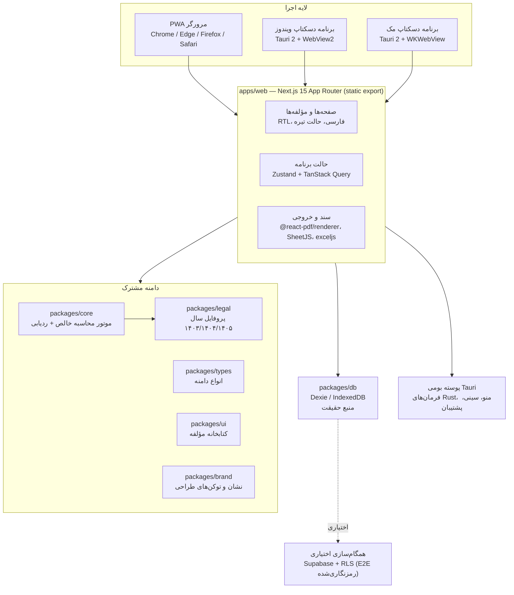
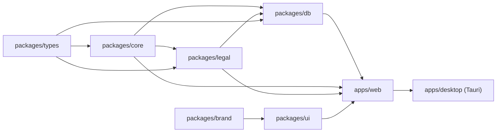
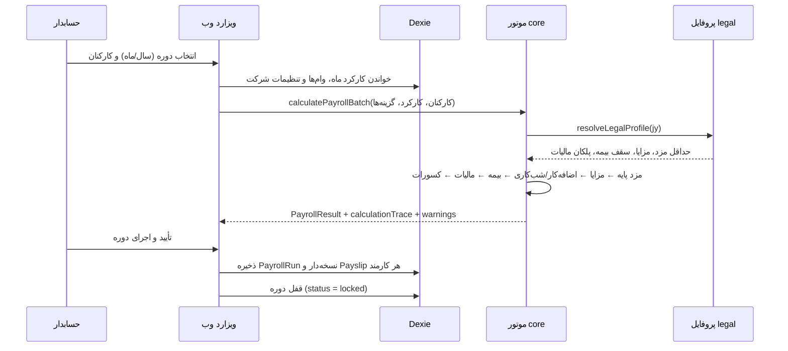
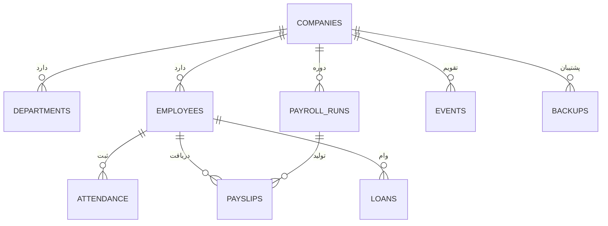
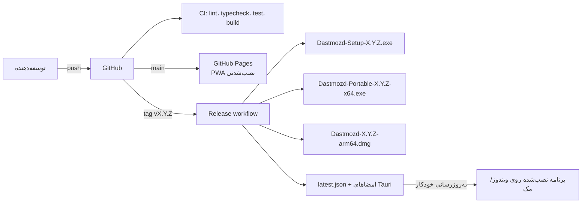

# معماری دستمزد آرمانی ۱۴۰۵

این سند ساختار فنی، تصمیم‌های معماری و مسیر داده را در سه بستهٔ اجرایی (وب نصب‌شدنی، دسکتاپ ویندوز/مک) توضیح می‌دهد.

## تصویر کلی



## ساختار مخزن



- **`packages/core`** هیچ وابستگی به React، مرورگر یا Dexie ندارد؛ توابع خالص و قطعی با پوشش آزمون ≥۹۵٪. همه محاسبات یک `calculationTrace[]` برمی‌گردانند که در رابط کاربری قابل مشاهده است.
- **`packages/legal`** پارامترهای سالانه را در `src/profiles/{1403,1404,1405}.ts` نگه می‌دارد و با `resolveLegalProfile(year)` نزدیک‌ترین پروفایل را با هشدار جانشینی برمی‌گرداند.
- **`packages/db`** تنها لایه‌ای است که با IndexedDB کار می‌کند: مخازن (employees, attendance, payroll, loans, companies, settings, events), سیاهه بازبینی زنجیره‌ای، رمزنگاری AES-GCM و پشتیبان.

## مسیر محاسبه حقوق



ترتیب محاسبه در `packages/core/src/engine/payroll.ts` ثابت است تا نتیجه، تکرارپذیر و قابل حسابرسی بماند:

1. محاسبه نرخ‌ها (روزانه، ساعتی، اضافه‌کار ۱٫۴، شب‌کاری ۱٫۳۵، جمعه/تعطیل ۱٫۴ + اضافه‌کار).
2. مزد پایه متناسب با روزهای کارکرد و پایه سنوات (در صورت احراز شرط یک سال سابقه).
3. مزایای ثابت (حق مسکن، بن، حق تأهل، حق اولاد برای هر فرزند واجد شرایط).
4. اضافه‌کار، شب‌کاری، کار در تعطیل، کسر تأخیر و غیبت.
5. بیمه تأمین اجتماعی سهم کارگر ۷٪، کارفرما ۲۳٪ و بیمه بیکاری ۳٪ با سقف هفت برابر حداقل مزد.
6. مالیات بر درآمد حقوق با پلکان ترقیقی و معافیت‌های ماده ۹۱.
7. کسورات قانونی و اختیاری (وام، مساعده، کسورات سفارشی) و مبلغ قابل پرداخت گردشده.

## مدل داده



- `PayrollRun` نسخه‌دار است: هر اجرای دوباره همان دوره، نسخه تازه می‌سازد و `meta.legalProfileHash` و `meta.engineVersion` را ثبت می‌کند تا نتیجه سال‌ها بعد قابل بازتولید باشد.
- سیاهه بازبینی (`audit`) با زنجیره درهم‌سازی فقط افزودنی است و `verifyAuditChain` سلامت آن را بررسی می‌کند.

## تصمیم‌های معماری

| تصمیم                                 | دلیل                                                                |
| ------------------------------------- | ------------------------------------------------------------------- |
| Dexie/IndexedDB به‌عنوان منبع حقیقت   | کارکرد کامل آفلاین، سرعت بالا، عدم ارسال داده شخصی به سرور          |
| خروجی ایستا (`output: 'export'`)      | انتشار ساده روی GitHub Pages و بارگذاری مستقیم در WebView بدون سرور |
| یک کدبیس برای وب و دسکتاپ             | جلوگیری از دوپیاده‌سازی محاسبه و اختلاف عددی بین نسخه‌ها            |
| موتور محاسبه بدون وابستگی             | آزمون‌پذیری، استفاده در آینده در سرور یا اسکریپت‌های دسته‌ای        |
| ثبت `calculationTrace` برای هر محاسبه | پاسخ به «چرا این عدد؟» برای حسابدار و حسابرس                        |
| پروفایل قانونی سالانه جدا             | تغییر مقررات بدون دست‌زدن به کد و بدون بازنویسی سابقه               |
| پشتیبان رمزنگاری‌شده `.dastmozd`      | انتقال امن بین دستگاه‌ها و آرشیو بلندمدت                            |

## امنیت و حریم خصوصی

- رمزنگاری در حالت سکون: AES-GCM با کلید مشتق‌شده از گذرواژه/PIN به روش PBKDF2-SHA256 با ۳۱۰٬۰۰۰ تکرار.
- بررسی یکپارچگی پشتیبان با SHA-256 پیش از بازگردانی.
- همگام‌سازی ابری اختیاری و سرتاسری رمزنگاری‌شده؛ داده شخصی هرگز به سرویس تحلیل نمی‌رود.
- در دسکتاپ، CSP سخت‌گیرانه اعمال می‌شود و دسترسی پرونده‌ای به پوشه پشتیبان محدود است.
- نشست‌ها با WebAuthn (اثر انگشت/چهره) و رمزنگاری محلی قابل قفل‌شدن هستند.

## آزمون و تضمین کیفیت

| لایه           | ابزار                                        | معیار پذیرش                                     |
| -------------- | -------------------------------------------- | ----------------------------------------------- |
| موتور و قوانین | Vitest                                       | پوشش خطوط ≥۹۵٪، عددهای مرجع ریالی               |
| لایه داده      | Vitest + fake-indexeddb                      | پوشش ≥۷۰٪، سناریوهای پشتیبان و بازبینی          |
| رابط کاربری    | Vitest + Testing Library                     | تبدیل‌ها، اعتبارسنجی و پیام‌های فارسی           |
| سرتاسری        | Playwright (کروم، فایرفاکس، وبی‌کیت، موبایل) | جریان کامل کارمند ← کارکرد ← حقوق ← فیش ← خروجی |
| دسترس‌پذیری    | @axe-core/playwright                         | صفر خطای WCAG 2.1 A/AA                          |
| کارایی         | Lighthouse (CI دستی)                         | ≥۹۵ در چهار دسته                                |

## استقرار



اسرار لازم برای انتشار (در تنظیمات مخزن تعریف شوند):

| نام                                  | کاربرد                                      |
| ------------------------------------ | ------------------------------------------- |
| `TAURI_SIGNING_PRIVATE_KEY`          | کلید خصوصی امضای بسته‌ها و به‌روزرسانی      |
| `TAURI_SIGNING_PRIVATE_KEY_PASSWORD` | گذرواژه کلید امضا                           |
| `TAURI_SIGNING_PUBLIC_KEY`           | کلید عمومی که در پیکربندی ساخت تزریق می‌شود |

> کلیدها هرگز در مخزن نگه‌داری نمی‌شوند؛ فایل `apps/desktop/src-tauri/tauri.updater.conf.json` و قابلیت `updater` در زمان ساخت توسط جریان CI ساخته می‌شوند و در `.gitignore` هستند.

## توسعه محلی

```bash
pnpm install
pnpm --filter web dev                  # وب روی http://localhost:3000
pnpm --filter @dastmozd/desktop dev    # دسکتاپ با Rust نصب‌شده
pnpm lint && pnpm typecheck && pnpm test
GITHUB_PAGES=false pnpm --filter web build && pnpm --filter web serve:static
pnpm --filter web screenshots          # تصاویر مستندات در docs/screenshots
```
